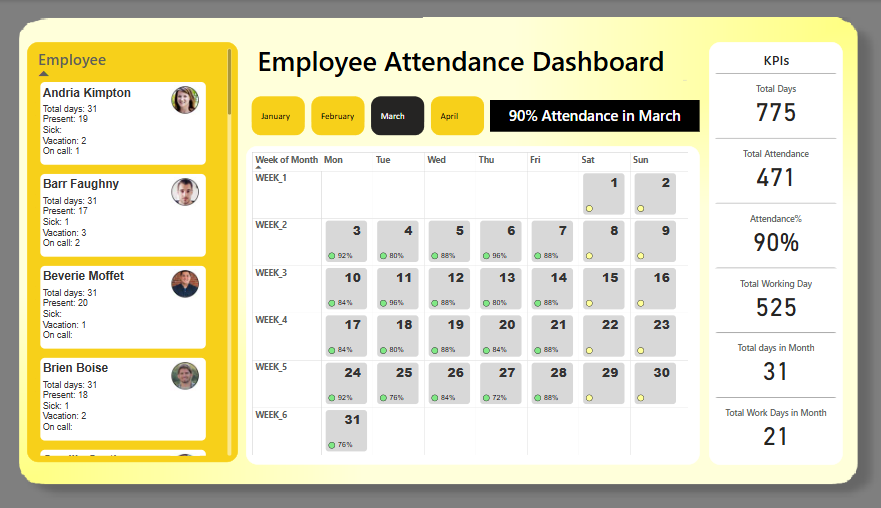

# 📊 Employee Attendance Dashboard – Power BI

An **interactive Power BI dashboard** designed to visualize employee attendance using dynamic visuals, SVG images, and optimized DAX logic.

This project demonstrates how to creatively apply Power BI features to personalize reports and optimize performance.

---

## 🚀 Project Overview

The dashboard tracks:
- Individual employee attendance
- Working days and present days
- Team-level segmentation
- Employee profile cards with images

It was developed with a focus on **interactivity**, **visual storytelling**, and **data-driven design**.

---

## 🔍 Key Features

✅ **SVG inside DAX** – to render dynamic employee profile visuals  
✅ **Image URL to Base64 conversion** – embedded directly as image bytes  
✅ Solved a critical visual bug by switching from **Multi-row Card** to **Table**  
✅ Dynamic DAX logic using:
- `SELECTEDVALUE()` to fetch individual data
- Date calculations for present/working days
- Conditional formatting for visuals

✅ Performance optimized for large string handling (image bytes)

---

## 📷 Preview

---

## 📂 Files Included

- `Emp_Attendance.pbix` – Full Power BI report file  
- `Emp_Att.png` – Preview image used in this README

---

## 📚 Learning Source

Tutorial and SVG concept learned from [Chandoo's Power BI YouTube tutorial](https://youtu.be/8rgLNBYQqmE?si=X5VYrwGlNhAo8S57)

---
Feel free to **clone, explore, and give feedback**.  
If you have suggestions or want to collaborate on enhancements, I'm open!

---

## 🏷️ Tags

`Power BI` `Data Visualization` `SVG in DAX` `Base64 Encoding` `Employee Dashboard` `Dynamic Measures` `Chandoo Tutorial`

